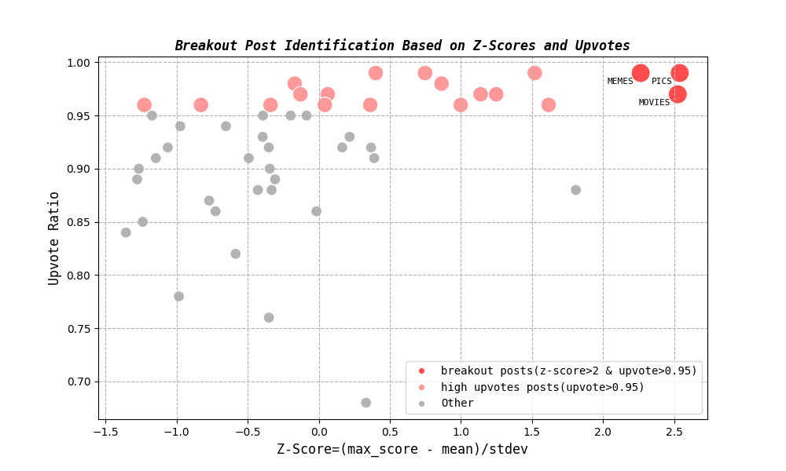
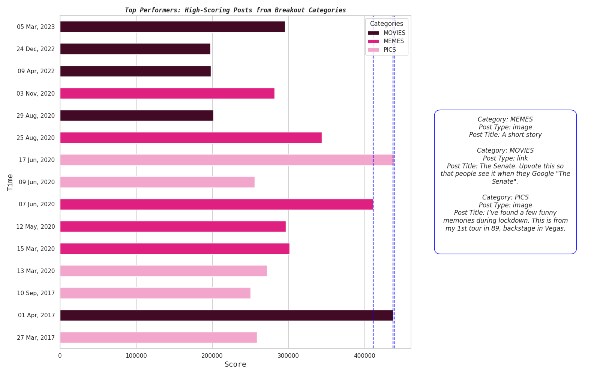

<h1 align="center">Identifying Breakout Reddit Posts</h1>

## Overview:
This project uses Python libraries like Matplotlib, Seaborn, NumPy, and Pandas to analyze the top 1000 posts of all time from 50 of Reddit's most popular subreddits. The dataset spans from September 2011 to September 2024, covering around 50,000 records and providing insights into content trends, user engagement, and breakout posts across various online communities.  
[Dataset Link](https://www.kaggle.com/datasets/sachinkanchan92/reddit-top-posts-50-subreddit-analysis-2011-2024/data)

## Dataset Description
- Score: Net vote count (upvotes minus downvotes).
- Upvote Ratio: Proportion of upvotes to total votes, reflecting the overall approval rating of a post.
- The data consists of posts from 50 different subreddits, allowing for a diverse look at Reddit's top-performing content over the past decade.

## Analysis Overview
1.  Z-Score Analysis (z_score_analysis.py)
- Objective: Identify categories of breakout posts by calculating the Z-score for the maximum scores from each category.
- Method:
    - Z-scores were calculated using the mean and standard deviation of the max scores across all categories.
    - This standardization helps in comparing the top posts across categories, showing how a category's top post compares to others.
- Key findings (Figure 1):
    - Categories like memes, pics, and movies showed the highest Z-scores (>2) and upvote ratios (>0.95).
    - A higher Z-score signifies that the top post from these categories is significantly higher than the average top post in other categories, marking them as exceptional performers.
2. Content Analysis (content_analysis.py)
- Method: Analyze the top-performing posts over time in the categories identified with high Z-scores (memes, pics, movies).
- Method:
    - Posts within these high-performing categories were analyzed against the time they were posted to understand patterns.
    - The top three posts (based on score) were identified, including their titles and the medium used (image or external link).
- Key Findings (Figure 2):
     - Interestingly, two of the top-performing posts (images) were posted during the summer of 2020, in the early months of the COVID-19 pandemic.
    - This suggests a potential correlation between pandemic-related events and user engagement on certain types of content (e.g., humor and memes).
## Conclusion
By identifying and analyzing breakout posts through Z-score normalization and time-based content analysis, the project reveals that categories like memes, pics, and movies stand out as consistent top performers. Additionally, historical context (like the COVID-19 pandemic) played a role in driving higher engagement in specific periods.

This analysis highlights what (content type), when (timeframe), and where (category) breakout posts are most likely to occur.

#### Figure 1

#### Figure 2
